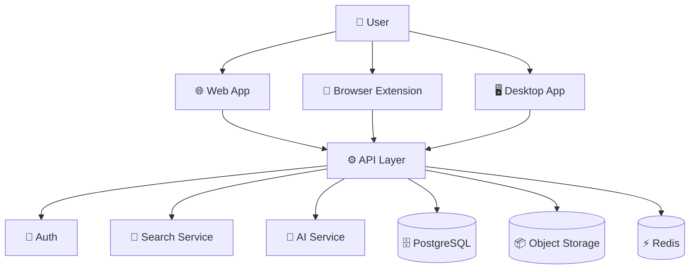
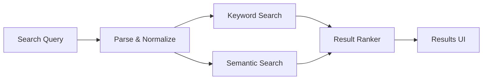
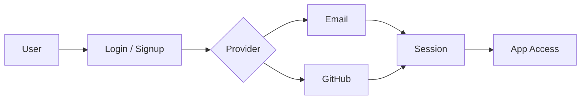
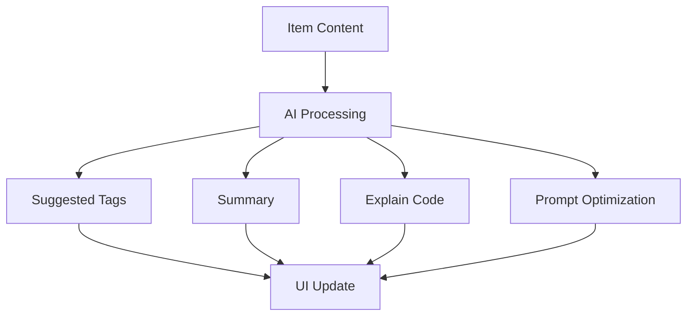

# DevApp — Project Overview

> **DevApp** is an AI-native developer knowledge hub for storing, searching, and reusing snippets, prompts, commands, notes, files, and links in one fast workspace.

---

## 1 Problem

Developers keep essential knowledge scattered across too many places:

- Code snippets in VS Code, gists, or Notion
- AI prompts in chat tools
- Context files buried inside projects
- Useful links in browser bookmarks
- Docs in random folders
- Commands in `.txt` files or terminal history
- Templates in GitHub repos or gists
- Reusable workflow notes in local files

That fragmentation causes:

- Context switching
- Lost knowledge
- Duplicate work
- Slow onboarding
- Inconsistent workflows
- Poor searchability

**DevApp solves this by becoming one searchable, AI-enhanced home for developer knowledge.**

---

## 2) Product Thesis

DevApp is not just a snippet manager.

It is a developer knowledge system built around three ideas:

1. **Capture quickly** — save things with minimal friction.
2. **Retrieve instantly** — search across titles, tags, content, and context.
3. **Reuse intelligently** — use AI to summarize, organize, tag, and explain.

---

## 3) Target Users

| Persona | What they need |
| --- | --- |
| Everyday Developer | Fast access to snippets, commands, links, and notes |
| AI-First Developer | Store prompts, workflows, context files, and system messages |
| Content Creator / Educator | Save course notes, examples, and reusable code blocks |
| Full-Stack Builder | Organize patterns, boilerplates, API references, and templates |
| Team / Startup | Shared knowledge, onboarding material, and repeatable engineering workflows |

---

## 4) Core Product Principles

- **Fast** — capture and search should feel immediate.
- **Structured** — every item should have type, tags, and metadata.
- **Searchable** — full-text and semantic search must be first-class.
- **AI-native** — AI should improve organization, retrieval, and reuse.
- **Developer-centric** — design around code, commands, prompts, and workflows.
- **Extensible** — support future plugins, integrations, and custom item types.
- **Cross-platform ready** — web-first now, with room for extension and desktop clients later.

---

## 5) Core Features

### 5.1 Knowledge Capture

Users can save:

- Snippets
- Prompts
- Notes
- Commands
- Files
- Images
- URLs / links
- Templates
- Context files
- Configs such as JSON, YAML, `.env` references, and deployment notes

### 5.2 Collections

Mixed-type collections for grouping related items.

Examples:

- React patterns
- API references
- AI prompts
- Deployment commands
- Onboarding materials
- Project context packs

### 5.3 Search

Search should work across:

- Titles
- Content
- Tags
- Item types
- Collections

Recommended search modes:

- Keyword search
- Full-text search
- Semantic search
- Filtered search by type/tag/collection
- AI-assisted search refinement

### 5.4 Organization

Useful organization controls:

- Tags
- Favorites
- Pinned items
- Recently used
- Smart collections
- Type filters
- Language filters

### 5.5 Editing

- Markdown editor for text items
- Code-friendly editor for snippets
- File upload support
- Syntax highlighting
- Preview mode

### 5.6 AI Features

- Auto-tagging
- AI summaries
- Explain code
- Prompt optimization
- Duplicate detection
- Context extraction
- Suggested related items

### 5.7 Authentication

- Email + password
- GitHub OAuth

### 5.8 Export / Import

- Import from files
- Export as JSON
- Export as ZIP
- Later: import from gists, Notion, bookmarks, or browser history

---

## 6) Suggested Information Model

The product should revolve around a few durable entities:

- **User** — the account owner
- **Workspace** — personal or team container
- **Collection** — a group of related items
- **Item** — a saved knowledge object
- **Tag** — lightweight classification
- **ItemType** — built-in or custom type definition
- **Attachment** — uploaded file or image

---

## 7) Draft Prisma Model

> This is a starting point, not a final schema.

```prisma
enum ItemContentType {
  TEXT
  FILE
  LINK
}

enum WorkspaceRole {
  OWNER
  ADMIN
  MEMBER
}

model User {
  id              String            @id @default(cuid())
  email           String            @unique
  name            String?
  image           String?
  isPro           Boolean           @default(false)

  workspaces      WorkspaceMember[]
  ownedWorkspaces Workspace[]        @relation("WorkspaceOwner")
  items           Item[]
  tags            Tag[]
  itemTypes       ItemType[]

  stripeCustomerId    String?
  stripeSubscriptionId String?

  createdAt       DateTime          @default(now())
  updatedAt       DateTime          @updatedAt
}

model Workspace {
  id          String            @id @default(cuid())
  name        String
  slug        String            @unique
  description String?
  ownerId     String
  owner       User              @relation("WorkspaceOwner", fields: [ownerId], references: [id])

  members     WorkspaceMember[]
  collections Collection[]
  items       Item[]
  tags        Tag[]
  itemTypes   ItemType[]

  createdAt   DateTime          @default(now())
  updatedAt   DateTime          @updatedAt
}

model WorkspaceMember {
  id          String        @id @default(cuid())
  workspaceId String
  userId      String
  role        WorkspaceRole  @default(MEMBER)

  workspace   Workspace     @relation(fields: [workspaceId], references: [id])
  user        User          @relation(fields: [userId], references: [id])

  createdAt   DateTime      @default(now())

  @@unique([workspaceId, userId])
}

model Collection {
  id          String     @id @default(cuid())
  name        String
  description String?
  icon        String?
  color       String?

  workspaceId String
  workspace   Workspace  @relation(fields: [workspaceId], references: [id])

  items       Item[]

  createdAt   DateTime   @default(now())
  updatedAt   DateTime   @updatedAt
}

model ItemType {
  id          String     @id @default(cuid())
  name        String
  slug        String
  icon        String?
  color       String?
  isSystem    Boolean    @default(false)

  workspaceId String?
  workspace   Workspace? @relation(fields: [workspaceId], references: [id])

  userId      String?
  user        User?      @relation(fields: [userId], references: [id])

  items       Item[]

  @@unique([workspaceId, slug])
}

model Item {
  id            String           @id @default(cuid())
  title         String
  description   String?
  contentType   ItemContentType
  content       String?
  url           String?
  language      String?
  isFavorite    Boolean          @default(false)
  isPinned      Boolean          @default(false)

  workspaceId   String
  workspace     Workspace        @relation(fields: [workspaceId], references: [id])

  collectionId  String?
  collection    Collection?      @relation(fields: [collectionId], references: [id])

  typeId        String
  type          ItemType         @relation(fields: [typeId], references: [id])

  ownerId       String
  owner         User             @relation(fields: [ownerId], references: [id])

  tags          ItemTag[]
  attachments   Attachment[]

  createdAt     DateTime         @default(now())
  updatedAt     DateTime         @updatedAt

  @@index([workspaceId, collectionId, typeId])
}

model Tag {
  id          String    @id @default(cuid())
  name        String
  slug        String
  workspaceId String
  workspace   Workspace @relation(fields: [workspaceId], references: [id])

  userId      String?
  user        User?     @relation(fields: [userId], references: [id])

  items       ItemTag[]

  @@unique([workspaceId, slug])
}

model ItemTag {
  itemId String
  tagId  String

  item   Item @relation(fields: [itemId], references: [id])
  tag    Tag  @relation(fields: [tagId], references: [id])

  @@id([itemId, tagId])
}

model Attachment {
  id          String   @id @default(cuid())
  itemId      String
  item        Item     @relation(fields: [itemId], references: [id])

  fileName    String
  fileUrl     String
  mimeType    String?
  fileSize    Int?

  createdAt   DateTime @default(now())
}
```

### Notes on the model

- Use **Workspace** even for solo users so the data model scales to teams later.
- Keep **ItemType** flexible so Pro users can define custom categories.
- Keep **Item** as the central entity and attach tags, collections, and files to it.
- Use `slug` fields for stable lookup and clean URLs.
- Keep indexes aligned with the most common filters and search paths.

---

## 8) Suggested Tech Stack

| Layer | Recommendation |
| --- | --- |
| Frontend | Next.js |
| UI | React + TypeScript |
| Styling | Tailwind CSS |
| Components | shadcn/ui |
| Database ORM | Prisma |
| Database | PostgreSQL |
| Cache / Queue | Redis, later if needed |
| File Storage | Cloudflare R2 or similar object storage |
| Authentication | Auth.js / NextAuth-style auth |
| AI Layer | OpenAI API |
| Deployment | Vercel or comparable platform |
| Monitoring | Sentry, later |

### Useful official docs

- Next.js: <https://nextjs.org/docs>
- Prisma: <https://www.prisma.io/docs>
- Mermaid: <https://mermaid.js.org/>
- OpenAI API: <https://platform.openai.com/docs>
- shadcn/ui: <https://ui.shadcn.com/>
- Tailwind CSS: <https://tailwindcss.com/docs>

---

## 9) High-Level Architecture



---

## 10) Search Flow



---

## 11) Auth Flow



---

## 12) AI Feature Flow



---

## 13) UI / UX Direction

- Dark mode first
- Minimal, developer-friendly UI
- Syntax highlighting for code blocks
- Strong keyboard navigation
- Fast search and filtering
- Clear item type badges
- Sidebars for collections and saved filters
- Editor-focused layout for text, snippets, and prompts

### Visual inspiration

- Notion for structure
- Linear for polish
- Raycast for speed
- Obsidian for knowledge density

---

## 14) Monetization

| Plan | Price | Limits | Included |
| --- | ---: | --- | --- |
| Free | $0 | Limited items and collections | Core storage, basic search, no AI |
| Pro | Paid | Higher or unlimited usage | AI features, custom types, export, advanced organization |
| Team | Paid | Shared workspace pricing | Collaboration, permissions, admin controls |

---

## 15) MVP Scope

Start with the smallest valuable version:

1. Authentication
2. Item CRUD
3. Collections
4. Tags
5. Search
6. Markdown / code editor
7. File uploads
8. Favorites / pinned items
9. Basic AI summary and tagging

### Explicit non-goals for MVP

- Team permissions
- Browser extension
- Desktop app
- Public sharing
- Full plugin system
- Enterprise billing
- Advanced collaboration

---

## 16) Roadmap

### Phase 1 — Foundation

- Auth
- Database schema
- CRUD
- Collections
- Tags
- Search

### Phase 2 — AI Layer

- Auto-tagging
- Summaries
- Explain code
- Prompt optimization

### Phase 3 — Product Expansion

- Import/export
- File support
- Custom item types
- Better filters
- Usage analytics

### Phase 4 — Ecosystem

- Browser extension
- VS Code extension
- Desktop app
- Team workspaces
- API and CLI

---

## 17) Risks to Watch

- Search quality becoming poor without strong metadata
- AI features feeling decorative instead of useful
- Data model becoming too rigid too early
- Overbuilding collaboration before core retrieval works
- Underestimating import/export needs

---

## 18) Recommended Next Documents

- `product-requirements.md`
- `information-architecture.md`
- `prisma-schema.md`
- `api-spec.md`
- `roadmap.md`
- `design-system.md`

---

## 19) Positioning Statement

**DevApp is the AI-native knowledge hub for developers who want to capture, find, and reuse technical context without losing time to scattered tools.**

### Design Refernces
